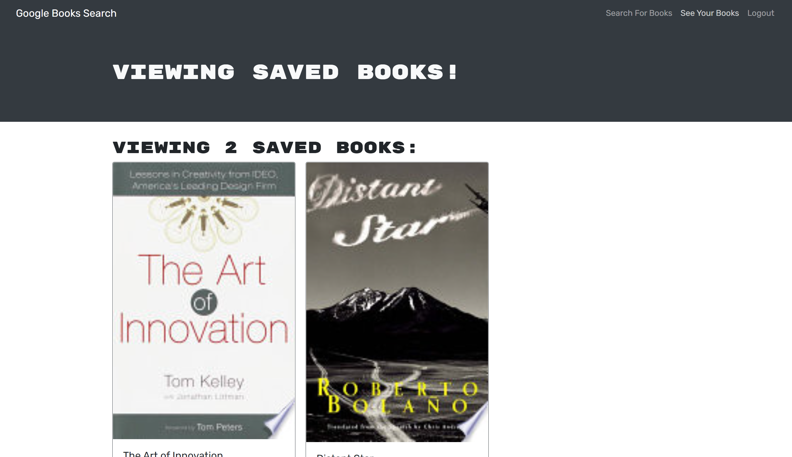

# Goodle Books 
        
  ## Description
    AS AN avid reader
    I WANT to search for new books to read
    SO THAT I can keep a list of books to purchase
          
  ## Table of Content
  - [Description](#description)
  - [Screenshot](#screenshot)
  - [Installation](#installation)
  - [Usage](#usage)
  - [Questions](#questions)

  ## Screenshot

  
  
  ## Installation
  1. Download the repository google-books from bin-ostrowski's GitHub. 
  2. Open the project in VS, then open a terminal from the root directoy.
  3. Run command `npm install`
  4. Run the command `npm run develop` to run the server and open the app on a localhost.
  6. If browser does not automatically open, navigate to http://localhost:3000
  7. Sing In.

  ## Usage
  [click here to deploy application!](https://immense-citadel-75341.herokuapp.com/)

 
  ## Questions
  GitHub: [Bin-Ostrowski](https://github.com/Bin-Ostrowski)
  
  Email: bin.ostrowski@gmail.com
  
  Please send any additional questions to the email listed above. 

